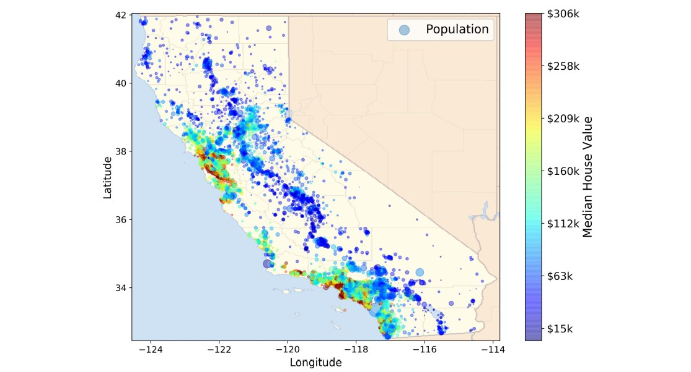

# My Experience with the "California House Pricing" Project

I recently embarked on a fascinating journey through Chapter 2 of the Hands-on Machine Learning book, where we delved into the "California House Pricing" project. This project provided me with invaluable hands-on experience in machine learning techniques using Scikit-Learn. Along the way, I encountered numerous challenges and difficulties, each of which contributed to my growth as a data scientist.

## Exploratory Data Analysis (EDA)
The initial stage involved extracting patterns and gaining a comprehensive understanding of the dataset. EDA was crucial in uncovering insights and identifying potential features for predicting house prices.

## Pipeline Data
Building an efficient data pipeline was no easy feat. However, it was essential for ensuring smooth data preprocessing and model training stages.

## One-Hot Encoding
Dealing with categorical variables required one-hot encoding, which posed its own set of challenges, especially in maintaining the integrity of the dataset.

## Data Splitting and Transformation
Splitting the data into training and testing sets, along with performing necessary transformations, demanded careful consideration to prevent data leakage and ensure model generalization.

## Building & Testing Models
Experimenting with various regression models, including Linear Regression, Decision Tree Regressor, Random Forest Regressor, and XGBRegressor, was both enlightening and challenging.

## Model Evaluation
Evaluating model performance was a critical step in determining the effectiveness of each algorithm. The evaluation metrics provided valuable insights into the strengths and weaknesses of each model.

## Model Comparison
- **Linear Regression**: REG Score: 0.611 | MAE: 49956 | MSE: 5097213857
- **Decision Tree Regressor**: TREE Score: 0.621 | MAE: 44315 | MSE: 4970813593
- **Random Forest Regressor**: RFG Score: 0.816 | MAE: 32102 | MSE: 2417620569
- **XGBRegressor**: XGB Score: 0.844 | MAE: 29000 | MSE: 2042656314

## Conclusion
Despite the challenges encountered, the project was immensely rewarding. The XGBRegressor emerged as the most promising model, achieving the highest score and lowest error metrics. However, each model provided valuable insights into the housing market dynamics in California.

I'm grateful for the opportunity to tackle this project, and I look forward to applying the skills and knowledge gained to future endeavors in the field of machine learning. If you're interested in discussing this project further or sharing your own experiences, feel free to connect with me!
